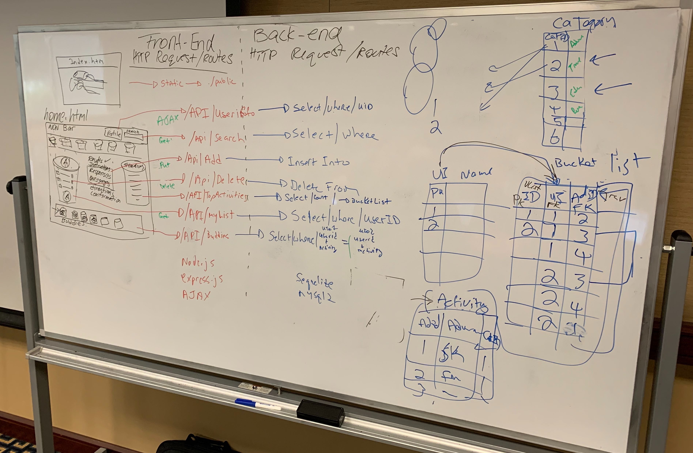
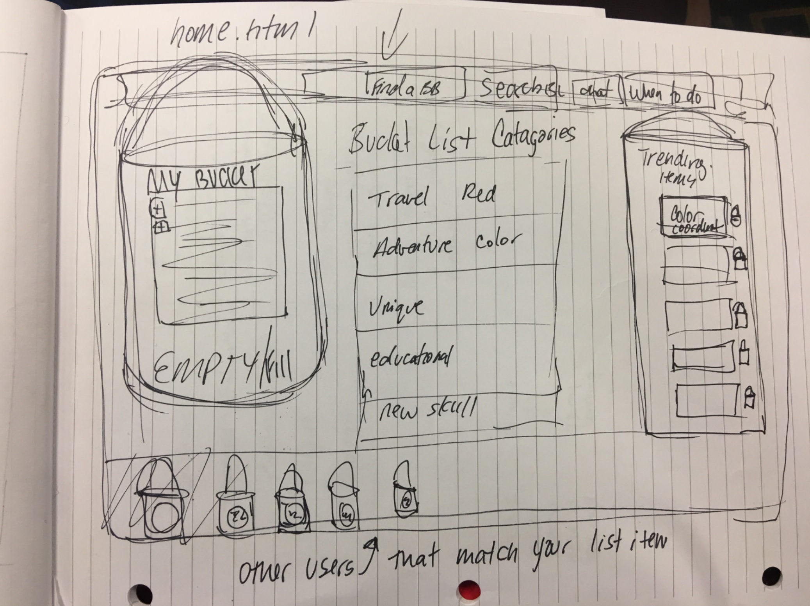

## BucketBuddy - We can do anything...together! **The what**
Bucket Buddy is an interactive site that enables a user to create a list of all the things they want to try, goals they want to achieve and life experiences they want to have before they die. After creating your own bucket list you are matched with other bucket buddies that have the same list items. Users are matched together and then given the information to be able to complete tasks together as groups.

## Links
- [GitHub](https://github.com/1nikita24/bucketbuddy)
- [Heroku](https://still-depths-21016.herokuapp.com)
- [Trello](https://trello.com/b/qYK8dkQY/bucketbuddy)
- [Prezi](https://prezi.com/p/pmdfdeyiy7e2/bucketbuddy-presentation/)

## Motivation - **The Why**
Setting up a way to experience unique and once in a life time experiences with others

## Technologies used and why
### Packages
- dotenv - security
- express - node web server
- firebase - authentication
- mysql - database
- mysql2 - database (sequelize)
- sequelize - promised based node.js ORM (database models)
- ORM - object relational modeling (database models)

### Hosting
- Heroku - external web server hosting

### Developed with
#### Front-end
- HTML5
- CSS3
- Bootstrap
- Fontawesome
- JQuery
- AJAX
- Javascript
- Firebase
- [ChartKick](https://www.chartjs.org/docs/latest/)
<b>Simple yet flexible JavaScript charting for designers & developers<b>

#### Back-end
- Express
- Node.js
- mySQL
- ORM
- Sequelize + mySQL2

## Features
Sharing life experiences with people with similiar interests.

## Screenshots
### logo & demo screenshots

### Planning

### Mockup

## Code Example

### Routes
* /api/testserver - tests that the express server is working
* /api/testdb - tests database connectivity
* /api/userprofile/:uid - gets user info by firebase uid
* /api/actbycat/:categoryId - gets activites when user clicks a category
* /api/mylist/:uid - used to fill the users bucketlist panel
* /api/categories - returns all categories (not used on site)
* /api/findbuddies/:actId/:ui -shows buddies who are doing the same activity on the bottom panel.
* /api/insertmylist/:userid/:actid - adds an activity to users bucket.
* /api/deletemylist/:id - deletes an activity from a users bucket
* /api/countactivities - counts by activity category (used by chartkick)

## Installation
- npm i (to install above mentioned npm packages)
- Create the database manullay by running the db/schema.sql file in mySQL
- Run server.js which will create the required tables using sequelize
- Import all the seeders/ files to poplute the tables to sample data
- Configure your database passwords in the connection.js and config.json files

## How to use?
node server.js

## Credits
Shout out to team "BucketBuddy"! 
@Mike, @Venessa, @Greg, @Nikita, @George

## License
MIT ©
Firebase
ChartKick